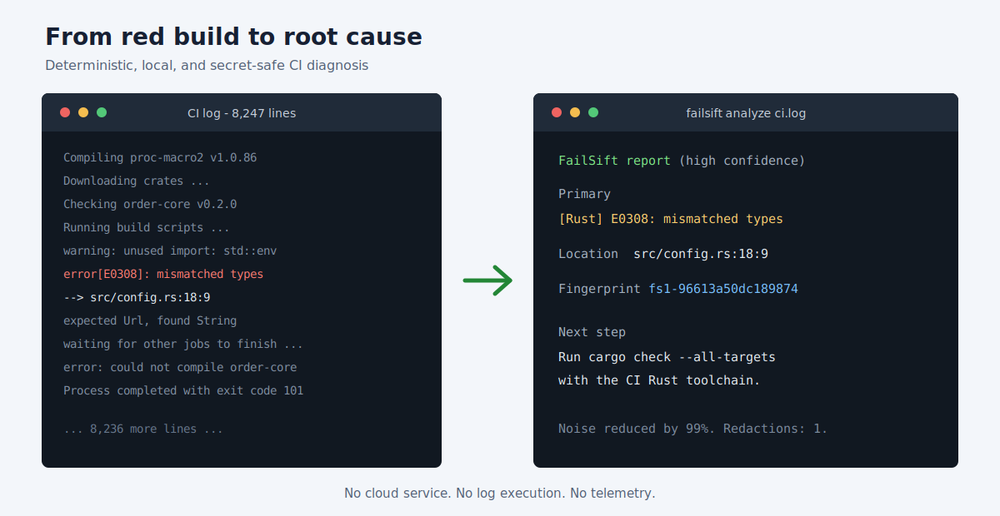

# FailSift

[](https://github.com/danisantgry/failsift/actions/workflows/ci.yml)
[](https://www.npmjs.com/package/failsift)
[](LICENSE)
[](PRIVACY.md)

FailSift turns noisy CI logs into a concise, secret-safe diagnosis. It ranks the likely root cause, separates cascade failures, suggests a next step, and emits terminal, Markdown, or versioned JSON reports.



## Why FailSift

A failed CI run often ends with a generic exit code while the useful error is buried thousands of lines earlier. FailSift applies deterministic parsers locally, redacts sensitive values before analysis, and reports the highest-signal failure without executing any log content.

- No account, service, model, API key, or telemetry.
- TypeScript, ESLint, Vitest/Jest, npm/pnpm/yarn, pytest, and generic runtime failures.
- Stable fingerprints for grouping recurring failures.
- Safe GitHub Action for completed workflow runs.
- Idempotent pull request comments instead of one new comment per rerun.

## Quick Start

Analyze a downloaded log:

```bash
npx failsift analyze ./ci.log
```

Pipe logs directly from GitHub CLI:

```bash
gh run view 123456 --log | npx failsift analyze -
```

Generate a report for automation:

```bash
npx failsift analyze ./ci.log --format json --output failsift-report.json
```

Example result:

```text
FailSift report (high confidence)
Source: ci.log

Primary: [TypeScript] TS2322: Type 'string' is not assignable to type 'number'.
Location: src/config.ts:18:7
Fingerprint: fs1-4d5be8a87a87a066
```

## GitHub Action

Create `.github/workflows/failsift.yml` in the repository that should receive diagnoses:

```yaml
name: FailSift

on:
  workflow_run:
    workflows: [CI]
    types: [completed]

permissions:
  actions: read
  contents: read
  pull-requests: write

jobs:
  diagnose:
    if: github.event.workflow_run.conclusion == 'failure'
    runs-on: ubuntu-latest
    steps:
      - uses: danisantgry/failsift@v0
        with:
          github-token: ${{ secrets.GITHUB_TOKEN }}
          run-id: ${{ github.event.workflow_run.id }}
```

The analyzer runs only after the original workflow completes. It downloads logs for failed jobs, never checks out pull request code, never executes log content, and uses the minimum permissions shown above. If no pull request is associated with the run, the report is written to the Action job summary only.

For stronger supply-chain pinning, replace `@v0` with a full release commit SHA.

## CLI

```text
failsift analyze <file|-> [--format terminal|markdown|json]
failsift analyze <file> --output <path> [--max-log-mb 50]
failsift github --repo owner/repo --run 123456 [--format markdown]
```

`failsift github` reads `GH_TOKEN` or `GITHUB_TOKEN` when authentication is needed. Successful analysis exits with code `0` even when the analyzed log describes a failure. Invalid input exits `2`; GitHub authentication or network failures exit `3`.

The JSON output is versioned with `schemaVersion: 1` and includes the source, primary and secondary failures, frameworks, suggestions, fingerprint, confidence, redaction count, limits, and reduction percentage.

## How It Works

```text
bounded input -> redaction -> normalization -> deterministic parsers
              -> ranking + deduplication -> fingerprint -> renderer
```

Parsers emit evidence rather than final prose. The ranking layer favors specific compiler and test errors, penalizes generic cascade messages, and deduplicates equivalent signals. See [the architecture](docs/ARCHITECTURE.md) and [parser guide](docs/PARSER_GUIDE.md).

## Privacy And Security

FailSift is local-first and has no telemetry. It removes common tokens, credentials, JWTs, API keys, email addresses, and user home paths before parsing or rendering. Logs are always treated as untrusted text.

Read [PRIVACY.md](PRIVACY.md) for the data model and [SECURITY.md](SECURITY.md) for responsible disclosure and Action hardening guidance. Redaction is defense in depth, so maintainers should still avoid placing secrets in CI output.

## Supported Signals

| Ecosystem | Signals in v0.1 |
| --- | --- |
| TypeScript | Compiler codes, files, lines, and columns |
| ESLint | Rule, file, line, and column |
| Vitest/Jest | Failed test files and assertion errors |
| npm/pnpm/yarn | Dependency resolution and lifecycle failures |
| pytest | Failed tests and exception summaries |
| Generic CI | Fatal errors, runtime errors, timeouts, and exit cascades |

Rust/Cargo and Go parsers are planned after the first external validation round.

## Development

Requires Node.js 20 or newer:

```bash
npm install
npm run check
npm run dev -- analyze test/fixtures/typescript.log
```

The quality gate runs strict TypeScript checks, behavioral tests, coverage thresholds of 90% for lines/functions/statements and 85% for branches, and a deterministic Action bundle build.

## Contributing

Real anonymized failure formats are especially valuable. Start with [CONTRIBUTING.md](CONTRIBUTING.md), open a parser request using the issue template, or pick a labeled good first issue. Never attach a raw log until you have checked it for secrets and personal data.

## Roadmap

- Validate the diagnosis against real public CI failures.
- Add Cargo and Go parsers from anonymized fixtures.
- Detect recurring fingerprints and likely flaky tests.
- Consider optional AI explanations only for already-redacted structured reports.

## License

[MIT](LICENSE)
